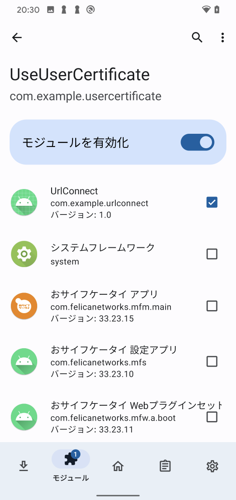

Android の User証明書の利用
=============

## 概要

Android 7以降のOSにてユーザ証明書を信頼しなくなっています｡

- https://android-developers.googleblog.com/2016/07/changes-to-trusted-certificate.html

本 Xposed Module は､ユーザ証明書にインストールされた証明書を無条件で信頼するようになります｡

### Magisk Module をインストール

1. Magisk Module をインストールする。

- https://github.com/LSPosed/LSPosed/releases (zygisk 版をインストール)

### Xposed Module をインストール

1. 「UseUserCertificate」フォルダ内の Xposed Module をインストール。

````sh
cd UseUserCertificate\app\release
adb install UseUserCertificate.apk
````

2. ユーザ証明書にBurpなどのRoot証明書をインストールする。

3. Moduleを適用したいアプリに対して有効にする。



TIP: Xposed Module有効後、Android端末を再起動しないとうまく認識しない場合があります。

