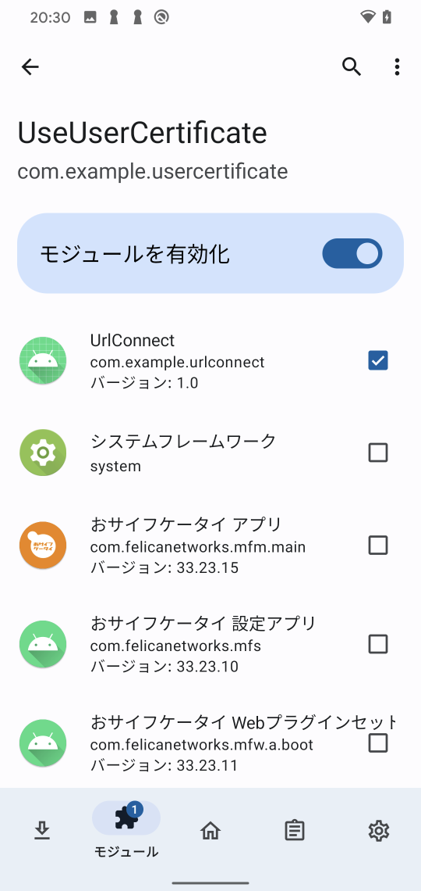

Using User Certificates for Android Apps
=============

Language/[日本語](Readme-ja.md)

## Overview

Android 7 and later operating systems, user certificates are no longer trusted by default.

- https://android-developers.googleblog.com/2016/07/changes-to-trusted-certificate.html

This Xposed Module will unconditionally trust the certificate installed in the user certificate.

### Install Magisk Module

1. Install Magisk Module.

- https://github.com/LSPosed/LSPosed/releases (Install zygisk version)

### Install Xposed Module

1. Install Xposed Module in the "UseUserCertificate" folder.

````sh
cd UseUserCertificate\app\release
adb install UseUserCertificate.apk
````

2. Install a Root certificate such as Burp for user certificates.

3. Enable the Module for the application to which you want to apply it.



TIP: After enabling Xposed Module, it may not be recognized properly unless the Android device is rebooted.

